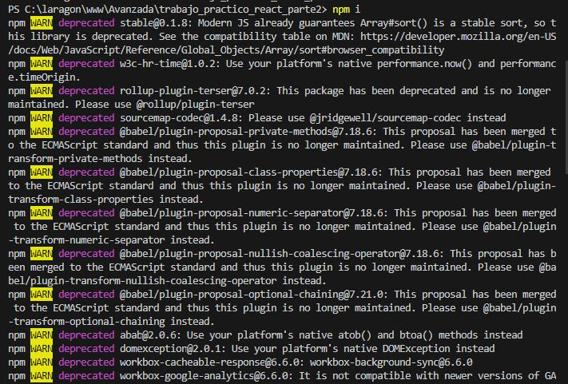
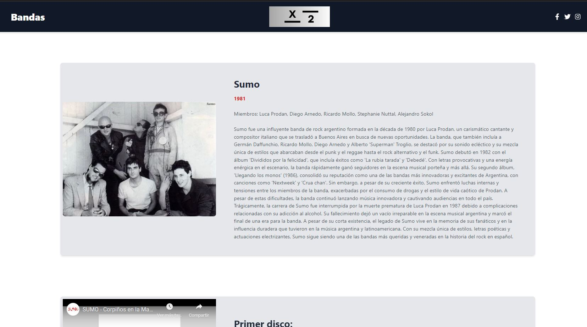

# Nombre del grupo:
  

## Integrantes del grupo: 
- Vidal Santiago
- Quiñiñires Melani

## Nombre del proyecto: 
Bandas x2

## Descripcion del proyecto:
Esta web es una plataforma para explorar información sobre diversas bandas de música. Utiliza una serie de mocks para representar la información de las bandas y proporcionar a los usuarios detalles relevantes sobre cada una de ellas.

## Tecnologías Utilizadas
- React: Utilizado para construir la interfaz de usuario con componentes reutilizables y gestionar el estado de la aplicación.
- React Router: Maneja la navegación entre las diferentes páginas de la aplicación, permitiendo un flujo de usuario fluido y dinámico sin recargar la página.
- Fetch API: Empleado para cargar los datos de los mocks representando llamadas a una API real.
- CSS Modules: Proporcionan estilos encapsulados para evitar conflictos y mantener la coherencia visual en toda la aplicación.

- Para implementar la descarga de la informacion de cada banda en formato pdf utilizamos <b>react-pdf</b>, que es una biblioteca que permite generar documentos PDF en aplicaciones de React tanto en el cliente como en el servidor. Al no utilizar una API externa la biblioteca react-pdf nos permite una integración sencilla y efectiva dentro de la aplicación React, proporcionando una experiencia de usuario fluida y rápida sin tener que depender de servicios externos o del servidor.

## Instalación

### Instrucciones
Para poder visualizar correctamente este proyecto debe seguir las siguientes instrucciones:
1. Instalar Node.js y npm: Node.js es un entorno de ejecución para JavaScript, y npm es el sistema de gestión de paquetes para Node.js. Se puede descargar e instalar Node.js desde su sitio web oficial: https://nodejs.org/en, descargar la ultima version estable e instalar. 
Una vez instalado Node.js, npm también se instalará automáticamente en tu sistema.
 2. Después de completar la instalación, se puede verificar que Node.js y npm se hayan instalado correctamente abriendo una ventana de terminal (cmd o PowerShell) y ejecutando los siguientes comandos:

<b>node -v </b> 

 <b>npm -v </b> 

Estos comandos imprimirán las versiones instaladas de Node.js y npm.

3. Instalar Git: 
Ir a https://git-scm.com/ y descargar la ultima version.
Instalarlo y luego ejecutar el siguiente comando en la terminal:

git --version

Este comando imprime la versión instalada de Git. Si ves la versión correctamente, significa que Git se ha instalado correctamente en tu sistema.

4. Crear una carpeta en donde dejar el proyecto 

5. Abrir la terminal (cmd), moverse a la carpeta recien creada
Ejemplo: si cree la carpeta Proyectos voy a ejecutar el siguiente comando:
cd C:\Users\USUARIO1\Documents\Proyectos

6. Clonar el repositorio con el comando:

git clone https://github.com/Santiag0Vidal/trabajo_practico_react_part

7. Luego ejecutar:

npm i 

Con este comando npm lee el archivo package.json en el directorio actual y busca la sección dependencies y devDependencies. Luego, descarga e instala todas las dependencias listadas en estas secciones en una carpeta llamada node_modules en el directorio del proyecto.
Al ejecutar el comando la terminal se verá asi, puede tardar unos minutos:

8. Finalizado estos pasos se puede ejecutar el comando:

npm start

y se inciciara la aplicacion.

Deberia visualizarse de la siguiente manera:

Y al acceder a la informacion de una banda en especifico, deberia verse asi:

